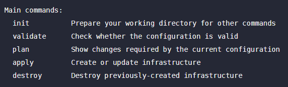

# A minimal Terraform with AWS example app

## Learning Objectives

provider
```Javascript
provider "aws" {
  access_key = var.access_key
  secret_key = var.secret_key
  region     = var.region
  assume_role {
    role_arn = "arn:aws:iam::1234567891011:role/Terraform_Admin"
  }
}
```

resource
```Javascript
resource "aws_s3_bucket" "Arbitrary_Name" {
  bucket = "learn-terraform123"

  tags = {
    Name          = "My Terraform S3 Bucket"
    Environment   = "sandbox"
  }
}
```


variables
```Javascript
variable "region" {
  description = "AWS Region to Deploy"
  default     = "us-east-2"
  type        = string # Base Types [string, number, bool]
  validation {         # length validation
    condition     = length(var.region) == 9
    error_message = "VALIDATION: Invalid Region Length"
  }
}
```

outputs
```Javascript
output "example_output_sensative" {
  description = "Example Output"
  value       = "example_output"
  sensitive   = true
}
```

functions
```Javascript
output "example_function" {
  description = "Example Output"
  value       = join("***", [tostring(var.region), "Random Arbitrary Text"]) # Example of join function
}
```

logging
```powershell
$env:TF_LOG="TRACE | DEBUG | INFO | WARN | ERROR"
$env:TF_LOG_PATH="./logs/terraform.log"
```

format
```powershell
terraform fmt
```

<br />

# Get Started (Windows OS)

- Install VS Code [https://code.visualstudio.com/Download]
- Install Github CLI [https://cli.github.com/]
- Download Terraform: [https://www.terraform.io/downloads]
- Extract Terraform .exe to a friendly directory
- Update Global PATH Variable to include the above directory
- Open this sandbox in VS Code
- Change the appropriate variables in terrafor.tfvars (AWS Access Key, Secret Key, etc...)
-  Run the following commands
  - gh repo clone drewnys/Terraform
  - terraform -init
  - terraform -plan
- Get comfortable with the main Terraform commands (init, validate, plan, apply, destroy)




<br />

# Terraform

- Website: [https://www.terraform.io]
- Forums: [HashiCorp Discuss](https://discuss.hashicorp.com/c/terraform-core)
- Documentation: [https://www.terraform.io/docs/](https://www.terraform.io/docs/)
- Functions: [https://www.terraform.io/language/functions]
- AWS Provider: [https://registry.terraform.io/providers/hashicorp/aws/latest/docs]
- Tutorials: [HashiCorp's Learn Platform](https://learn.hashicorp.com/terraform)
- Certification Exam: [HashiCorp Certified: Terraform Associate](https://www.hashicorp.com/certification/#hashicorp-certified-terraform-associate)

<br />


Terraform is a tool for building, changing, and versioning infrastructure safely and efficiently. Terraform can manage existing and popular service providers as well as custom in-house solutions.

The key features of Terraform are:

- **Infrastructure as Code**: Infrastructure is described using a high-level configuration syntax. This allows a blueprint of your datacenter to be versioned and treated as you would any other code. Additionally, infrastructure can be shared and re-used.

- **Execution Plans**: Terraform has a "planning" step where it generates an execution plan. The execution plan shows what Terraform will do when you call apply. This lets you avoid any surprises when Terraform manipulates infrastructure.

- **Resource Graph**: Terraform builds a graph of all your resources, and parallelizes the creation and modification of any non-dependent resources. Because of this, Terraform builds infrastructure as efficiently as possible, and operators get insight into dependencies in their infrastructure.

- **Change Automation**: Complex changesets can be applied to your infrastructure with minimal human interaction. With the previously mentioned execution plan and resource graph, you know exactly what Terraform will change and in what order, avoiding many possible human errors.

For more information, refer to the [What is Terraform?](https://www.terraform.io/intro) page on the Terraform website.


